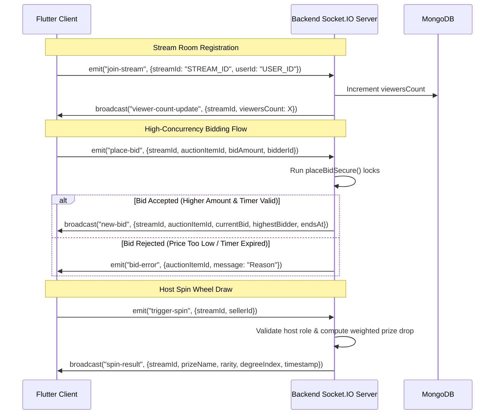

# Culture Cards LLC — Complete API Integration Guide (Flutter) 🚀

This document serves as the master API integration manual for the mobile application developers of Culture Cards LLC. It details every available endpoint, exact JSON payloads derived from the server's Zod schemas, multipart form data mappings, Stripe payment intent configurations, Socket.IO live stream events, error code handlers, and Dart models.

---

## 📂 Table of Contents
1. [Client Setup & Interceptor (Dio)](#-1-client-setup--interceptor-dio)
2. [Auth Module](#-2-auth-module)
3. [User & Profile Module](#-3-user--profile-module)
4. [Product Listings Module](#-4-product-listings-module)
5. [Live Auctions Module](#-5-live-auctions-module)
6. [Trade / Barter Swaps Module](#-6-trade--barter-swaps-module)
7. [Order Tracking & Shipping Module](#-7-order-tracking--shipping-module)
8. [Payment Module (Stripe Setup & Checkout)](#-8-payment-module-stripe-setup--checkout)
9. [Subscription Module](#-9-subscription-module)
10. [Chat Module](#-10-chat-module)
11. [Message Module](#-11-message-module)
12. [Notification Module](#-12-notification-module)
13. [Category Module](#-13-category-module)
14. [Favourite Module](#-14-favourite-module)
15. [Review Module](#-15-review-module)
16. [Support Module](#-16-support-module)
17. [Location Module](#-17-location-module)
18. [Upload Module (S3 Presigned URLs)](#-18-upload-module-s3-presigned-urls)
19. [Public Module](#-19-public-module)
20. [Dashboard Module](#-20-dashboard-module)
21. [Socket.IO Real-Time Stream Event Guide](#-21-socketio-real-time-stream-event-guide)
22. [Error Handling Reference](#-22-error-handling-reference)
23. [Common Enums & Constants in Dart](#-23-common-enums--constants-in-dart)
24. [Comprehensive Endpoints Reference Table](#-24-comprehensive-endpoints-reference-table)

---

## 📦 1. Client Setup & Interceptor (Dio)

Configure **Dio** to automatically inject the Bearer token and handle token refresh when receiving `401 Unauthorized` responses. The refresh token logic reads from the response's `Set-Cookie` header or stored secure storage and calls `/auth/refresh-token`.

```dart
import 'package:dio/dio.dart';
import 'package:flutter_secure_storage/flutter_secure_storage.dart';

final secureStorage = const FlutterSecureStorage();

final dio = Dio(BaseOptions(
  baseUrl: 'https://api.culturecardsllc.com/api/v1',
  connectTimeout: const Duration(seconds: 15),
  receiveTimeout: const Duration(seconds: 15),
  headers: {
    'Content-Type': 'application/json',
    'Accept': 'application/json',
  },
));

void initializeDio() {
  dio.interceptors.add(InterceptorsWrapper(
    onRequest: (options, handler) async {
      final accessToken = await secureStorage.read(key: 'accessToken');
      if (accessToken != null) {
        options.headers['Authorization'] = 'Bearer $accessToken';
      }
      return handler.next(options);
    },
    onError: (DioException error, handler) async {
      if (error.response?.statusCode == 401) {
        final refreshToken = await secureStorage.read(key: 'refreshToken');
        if (refreshToken != null) {
          try {
            // Server expects refreshToken from cookies or authorization request options
            final refreshResponse = await dio.post(
              '/auth/refresh-token',
              options: Options(
                headers: {
                  'Cookie': 'refreshToken=$refreshToken',
                },
              ),
            );
            
            final newAccessToken = refreshResponse.data['data']['accessToken'];
            await secureStorage.write(key: 'accessToken', value: newAccessToken);
            
            // Clone the original request with the new token
            final requestOptions = error.requestOptions;
            requestOptions.headers['Authorization'] = 'Bearer $newAccessToken';
            
            final cloneReq = await dio.request(
              requestOptions.path,
              options: Options(
                method: requestOptions.method,
                headers: requestOptions.headers,
              ),
              data: requestOptions.data,
              queryParameters: requestOptions.queryParameters,
            );
            return handler.resolve(cloneReq);
          } catch (e) {
            // Force logout: delete keys and navigate to Login Screen
            await secureStorage.delete(key: 'accessToken');
            await secureStorage.delete(key: 'refreshToken');
            // Emit force logout event via EventBus or Stream
          }
        }
      }
      return handler.next(error);
    },
  ));
}
```

---

## 🔑 2. Auth Module
*Path Prefix: `/auth`*

### 1. Register User (Sign Up)
* **Endpoint:** `POST /auth/signup`
* **Auth Required:** No
* **Body (JSON):**
```json
{
  "email": "collector@example.com", // Optional, string, valid email format
  "password": "SecurePassword123", // Required, string, min 6 characters
  "name": "john_doe", // Optional, string
  "phone": "+1234567890", // Optional, string, must pass phone validation check
  "interest": ["tcg", "sports_cards"], // Optional, array of InterestCategory strings
  "address": { // Optional
    "city": "Jersey City",
    "postalCode": "07302",
    "country": "US",
    "permanentAddress": "123 Collectors St",
    "presentAddress": "123 Collectors St"
  },
  "role": "buyer" // Optional, enum ["buyer", "seller"]. Defaults to "buyer"
}
```

### 2. Login User (Custom)
* **Endpoint:** `POST /auth/login`
* **Auth Required:** No
* **Body (JSON):**
```json
{
  "email": "collector@example.com", // Optional (either email or phone required)
  "phone": "+1234567890", // Optional
  "password": "SecurePassword123", // Required, min 6 characters
  "deviceToken": "fcm_token_xyz", // Optional, string (for push notifications)
  "rememberMe": true // Optional, boolean
}
```
* **Response Data:** Returns `{ accessToken, refreshToken, role }`. The `refreshToken` is also set as an HTTP-only cookie `refreshToken`.

### 3. Admin Login
* **Endpoint:** `POST /auth/admin-login`
* **Auth Required:** No
* **Body (JSON):** Same as User Login.

### 4. Verify Account (OTP)
* **Endpoint:** `POST /auth/verify-account`
* **Auth Required:** No
* **Body (JSON):**
```json
{
  "email": "collector@example.com", // Optional
  "phone": "+1234567890", // Optional
  "oneTimeCode": "1234" // Required, OTP string
}
```

### 5. Forgot Password
* **Endpoint:** `POST /auth/forget-password`
* **Auth Required:** No
* **Body (JSON):**
```json
{
  "email": "collector@example.com", // Optional
  "phone": "+1234567890" // Optional
}
```

### 6. Reset Password
* **Endpoint:** `POST /auth/reset-password`
* **Auth Required:** No
* **Body (JSON):**
```json
{
  "newPassword": "NewSecurePassword123", // Required, min 8 characters
  "confirmPassword": "NewSecurePassword123" // Required, must match newPassword
}
```
* **Header Requirement:** Must include the password reset token returned in OTP verification as a Bearer authorization token if resetting outside authenticated scopes.

### 7. Resend OTP
* **Endpoint:** `POST /auth/resend-otp`
* **Auth Required:** No
* **Body (JSON):**
```json
{
  "email": "collector@example.com", // Optional
  "phone": "+1234567890", // Optional
  "authType": "createAccount" // Optional, enum ["resetPassword", "createAccount"]
}
```

### 8. Change Password
* **Endpoint:** `POST /auth/change-password`
* **Auth Required:** Yes (any role)
* **Body (JSON):**
```json
{
  "currentPassword": "SecurePassword123", // Required
  "newPassword": "NewSecurePassword123", // Required, min 8 characters
  "confirmPassword": "NewSecurePassword123" // Required, must match newPassword
}
```

### 9. Social Login
* **Endpoint:** `POST /auth/social-login`
* **Auth Required:** No
* **Body (JSON):**
```json
{
  "appId": "social_uid_123456", // Required
  "deviceToken": "fcm_token_xyz" // Required
}
```

### 10. Refresh Token
* **Endpoint:** `POST /auth/refresh-token`
* **Auth Required:** No
* **Body (JSON):** Expects the `refreshToken` in request cookies. (If client doesn't support cookies, pass the cookie header manually, see [Client Setup](#-1-client-setup--interceptor-dio)).
* **Response Data:** Returns a new `{ accessToken }`.

### 11. Logout
* **Endpoint:** `POST /auth/logout`
* **Auth Required:** Yes (any role)
* **Body:** None

### 12. Delete Account
* **Endpoint:** `DELETE /auth/delete-account`
* **Auth Required:** Yes (buyer or admin)
* **Body (JSON):**
```json
{
  "password": "SecurePassword123" // Required
}
```

---

## 👤 3. User & Profile Module
*Path Prefix: `/users`*

### 1. Get Profile
* **Endpoint:** `GET /users/profile`
* **Auth Required:** Yes (any role)
* **Response Data:** Returns detailed profile information for the authenticated user.

### 2. Update Profile (Multipart/Form-Data)
* **Endpoint:** `PATCH /users/profile`
* **Auth Required:** Yes (any role)
* **Content-Type:** `multipart/form-data`
* **Fields:**
  * `data`: (Optional JSON string containing metadata)
  ```json
  {
    "name": "John Doe",
    "phone": "+1234567890",
    "description": "Retro game and TCG card trader.",
    "specialty": "Pokemon TCG",
    "address": {
      "city": "Jersey City",
      "postalCode": "07302",
      "country": "US",
      "permanentAddress": "123 Collectors St"
    },
    "location": {
      "type": "Point",
      "coordinates": [-74.0431, 40.7178] // [longitude, latitude]
    },
    "deviceToken": "new_fcm_token"
  }
  ```
  * `profile`: File upload (single profile image)
  * `coverPhoto`: File upload (single cover photo image)
* **Dart Code Snippet:**
```dart
Future<void> updateProfile({
  required String name,
  required String description,
  Map<String, dynamic>? address,
  File? profileFile,
  File? coverFile,
}) async {
  final Map<String, dynamic> metadata = {
    'name': name,
    'description': description,
    if (address != null) 'address': address,
  };
  
  final formData = FormData.fromMap({
    'data': jsonEncode(metadata), // Server parses req.body.data if present
    if (profileFile != null)
      'profile': await MultipartFile.fromFile(profileFile.path, filename: 'profile.jpg'),
    if (coverFile != null)
      'coverPhoto': await MultipartFile.fromFile(coverFile.path, filename: 'cover.jpg'),
  });

  await dio.patch('/users/profile', data: formData);
}
```

### 3. Switch Role
* **Endpoint:** `PATCH /users/switch-role`
* **Auth Required:** Yes (buyer or seller)
* **Body (JSON):**
```json
{
  "role": "seller" // Required, enum ["buyer", "seller"]
}
```
* *Flutter Note:* On success, updates the user's active context role. Update local storage with the new token pair returned in response.

### 4. Deactivate Profile
* **Endpoint:** `PATCH /users/deactivate-profile`
* **Auth Required:** Yes (any role)
* **Body:** None

### 5. Get User By ID
* **Endpoint:** `GET /users/:userId`
* **Auth Required:** Yes (buyer, seller, or admin)

### 6. Get All Users (Admin)
* **Endpoint:** `GET /users`
* **Auth Required:** Yes (admin, super_admin, or seller)

### 7. Update User Status (Admin)
* **Endpoint:** `PATCH /users/:userId`
* **Auth Required:** Yes (admin, super_admin)
* **Body (JSON):**
```json
{
  "status": "inactive" // Required, enum ["active", "inactive", "deleted"]
}
```

### 8. Delete User (Admin)
* **Endpoint:** `DELETE /users/:userId`
* **Auth Required:** Yes (admin, super_admin)

---

## 🎴 4. Product Listings Module
*Path Prefix: `/products`*

### 1. Create Product
* **Endpoint:** `POST /products`
* **Auth Required:** No (Wait, although auth isn't enforced at route path middleware, always pass headers as standard).
* **Body (JSON):**
```json
{
  "title": "Base Set Charizard Holographic 1999", // Required, min 3 chars
  "description": "PSA 8 Near Mint condition card.", // Optional
  "images": [
    "https://culturecards-s3.s3.amazonaws.com/videos/1719273562-pika.jpg"
  ], // Required, array of S3 URLs, min 1 image
  "video": "https://culturecards-s3.s3.amazonaws.com/videos/1719273562-pika.mp4", // Optional
  "category": "TCG", // Required, enum ["Fine Art", "Sports Cards", "Rare Spirits", "Luxury Cars", "Electronics", "Streetwear", "TCG", "Digital Assets"]
  "condition": "Near Mint", // Required, enum ["Mint", "Near Mint", "Excellent", "Good", "Fair"]
  "estValue": 1200, // Required, non-negative number
  "startingBid": 100, // Optional
  "reservePrice": 800, // Optional
  "buyNowPrice": 1100, // Optional
  "allowTrade": true, // Optional
  "sellerId": "65b98f21bc90a8274567abcd" // Required, 24-character hex ID of seller
}
```

### 2. Get All Products (Filtered)
* **Endpoint:** `GET /products`
* **Query Parameters:** `?category=TCG&condition=Near+Mint&allowTrade=true&page=1&limit=10`
* **Response Data:** Returns paginated list of active products.

### 3. Get Product Details
* **Endpoint:** `GET /products/:productId`
* **Response Data:** Complete details of the product including the seller information.

### 4. Update Product
* **Endpoint:** `PATCH /products/:productId`
* **Body (JSON):**
```json
{
  "title": "Updated Charizard Holographic 1999",
  "status": "active", // enum ["active", "sold", "unsold", "pending"]
  "stock": 0 // non-negative number
  // Any other parameter from creation body is optional here
}
```

### 5. Delete Product
* **Endpoint:** `DELETE /products/:productId`

---

## 🎥 5. Live Auctions Module
*Path Prefix: `/auctions`*

### 1. Generate Agora Token
* **Endpoint:** `GET /auctions/token`
* **Query Parameters:** `?channelName=collectibles-stream&uid=1234&role=publisher`
  * `channelName`: String (Agora channel name)
  * `uid`: Number/String (User identification number)
  * `role`: String (`publisher` for host/seller, `subscriber` for bidding viewers)
* **Response Data:** Returns the token generated for Agora RTC audio/video stream session joining.

### 2. Start Live Stream (Host)
* **Endpoint:** `POST /auctions/stream`
* **Body (JSON):**
```json
{
  "title": "TCG Live Break Night!", // Required, min 3 chars
  "description": "Opening booster packs live and bidding.", // Optional
  "scheduledAt": "2026-06-25T20:00:00.000Z", // Optional, ISO Date string
  "sellerId": "65b98f21bc90a8274567abcd", // Required
  "agoraChannelName": "collectibles-stream" // Optional
}
```

### 3. Get Live Streams List
* **Endpoint:** `GET /auctions/streams`
* **Query Parameters:** `?status=live&page=1&limit=10`

### 4. Add Auction Item to Stream
* **Endpoint:** `POST /auctions/item`
* **Body (JSON):**
```json
{
  "streamId": "65b98f21bc90a8274567ab00", // Required
  "productId": "65b98f21bc90a8274567abef", // Required
  "startingBid": 150, // Optional
  "bidIncrement": 10, // Optional, defaults to 5 or 10
  "timerDuration": 60 // Optional, duration in seconds (min 5)
}
```

### 5. Place Secure Bid (REST fallback)
* **Endpoint:** `POST /auctions/bid`
* **Body (JSON):**
```json
{
  "auctionItemId": "65b98f21bc90a8274567abcc", // Required
  "bidderId": "65b98f21bc90a8274567abdd", // Required
  "bidAmount": 180 // Required, positive number
}
```
* **Response Data:** Returns updated high bid information.
* *Socket Alert:* Live stream auctions should emit bidding requests over Socket.IO instead of REST for faster throughput. See [Socket Section](#-21-socketio-real-time-stream-event-guide).

---

## 🤝 6. Trade / Barter Swaps Module
*Path Prefix: `/trades`*

Allows direct item-to-item trading (bartering) between users with optional cash supplements.

### 1. Propose Barter Offer
* **Endpoint:** `POST /trades/offer`
* **Auth Required:** Yes (buyer or seller)
* **Body (JSON):**
```json
{
  "senderId": "65b98f21bc90a8274567abdd", // Required (Your ID)
  "receiverId": "65b98f21bc90a8274567abcd", // Required (Target User ID)
  "senderProductId": "65b98f21bc90a8274567ab11", // Required (Your card ID)
  "receiverProductId": "65b98f21bc90a8274567abef", // Required (Card you want)
  "cashSupplement": 100 // Optional, non-negative number. Positive represents extra top-up cash you pay.
}
```

### 2. Get Trade Offers List
* **Endpoint:** `GET /trades/offers`
* **Auth Required:** Yes (any role)
* **Query Parameters:** `?userId=65b98f21bc90a8274567abdd&type=sent` (or `type=received`)

### 3. Accept Trade Offer (Escrow Initiation)
* **Endpoint:** `POST /trades/accept/:tradeOfferId`
* **Auth Required:** Yes (receiver of the offer only)
* **Body:** None
* *Process:* Moves products into swap locks, preparing shipment protocols.

### 4. Decline Trade Offer
* **Endpoint:** `POST /trades/decline/:tradeOfferId`
* **Auth Required:** Yes (receiver only)
* **Body:** None

---

## 🚚 7. Order Tracking & Shipping Module
*Path Prefix: `/orders`*

Manages shipment checkpoints, delivery status, and invoice parameters.

### 1. Checkout Buy Now Order
* **Endpoint:** `POST /orders`
* **Auth Required:** Yes (buyer or seller)
* **Body (JSON):**
```json
{
  "buyerId": "65b98f21bc90a8274567abdd", // Required
  "sellerId": "65b98f21bc90a8274567abcd", // Required
  "productId": "65b98f21bc90a8274567abef", // Required
  "purchaseType": "buy_now", // Required, enum ["auction_win", "buy_now", "trade_swap"]
  "amountDetails": { // Required
    "itemSubtotal": 1100, // Required
    "shipping": 15, // Optional, defaults to 0
    "taxes": 8.25, // Optional, defaults to 0
    "processingFee": 2.50, // Optional, defaults to 0
    "charityContribution": 0, // Optional
    "totalPaid": 1125.75 // Required
  },
  "shippingAddress": { // Required
    "street": "456 Luxury Way", // Required
    "city": "Beverly Hills", // Required
    "state": "CA", // Required
    "postalCode": "90210", // Required
    "country": "US" // Required
  },
  "paymentIntentId": "pi_3MtwMQHsiFqooIa51Sp4iOp2" // Optional (Stripe reference)
}
```

### 2. Get Orders List for User
* **Endpoint:** `GET /orders/user`
* **Auth Required:** Yes (any role)
* **Query Parameters:** `?role=buyer` (or `?role=seller`)

### 3. Get Order Details & Journey
* **Endpoint:** `GET /orders/:orderId`
* **Auth Required:** Yes (any role)

### 4. Update Shipment Checkpoint
* **Endpoint:** `PATCH /orders/journey/:orderId`
* **Auth Required:** Yes (buyer, seller, admin, or super_admin)
* **Body (JSON):**
```json
{
  "status": "In Transit", // Required, min 2 chars
  "description": "Dropped off at FedEx facility and scanned.", // Required, min 3 chars
  "location": "Dallas, TX", // Optional
  "deliveryStatus": "shipped" // Optional, enum ["pending", "shipped", "delivered", "cancelled"]
}
```

---

## 💳 8. Payment Module (Stripe Setup & Checkout)
*Path Prefix: `/payment`*

Enables secure credit card entry using the Stripe SDK inside Flutter via PaymentIntents and SetupIntents.

### 1. Get My Payment Methods
* **Endpoint:** `GET /payment/methods`
* **Auth Required:** Yes (buyer, admin, super_admin)
* **Response Data:** Returns array of Stripe payment methods attached to the customer.

### 2. Create Setup Intent
* **Endpoint:** `POST /payment/create-setup-intent`
* **Auth Required:** Yes (buyer, admin, super_admin)
* **Response Data:** Returns `{ clientSecret }` used by Stripe Mobile SDK to link a card without charging.

### 3. Set Default Payment Method
* **Endpoint:** `PATCH /payment/methods/:paymentMethodId/default`
* **Auth Required:** Yes (buyer)

### 4. Delete Payment Method
* **Endpoint:** `DELETE /payment/methods/:paymentMethodId`
* **Auth Required:** Yes (buyer, admin, super_admin)

### 5. Create Checkout Session (Stripe Web Checkout UI)
* **Endpoint:** `POST /payment/create-checkout-session`
* **Auth Required:** Yes (seller, buyer)
* **Body (JSON):**
```json
{
  "bookingId": "65b98f21bc90a8274567abef", // Required (corresponds to productId / serviceId)
  "amount": 1100, // Optional
  "currency": "USD", // Optional, defaults to "EUR"
  "productName": "Base Set Charizard Card", // Optional
  "description": "PSA 8 Holographic" // Optional
}
```

### 6. Verify Checkout Session
* **Endpoint:** `GET /payment/verify-checkout/:sessionId`
* **Auth Required:** Yes (seller, buyer)

### 7. Create Payment Intent (Native App Checkout)
* **Endpoint:** `POST /payment/create-payment-intent`
* **Auth Required:** Yes (any role)
* **Body (JSON):** Same as Checkout Session.
```json
{
  "bookingId": "65b98f21bc90a8274567abef",
  "amount": 1100,
  "currency": "USD"
}
```
* **Response Data:** Returns `{ clientSecret, paymentIntentId }` to confirm charging within Flutter using `flutter_stripe`.

### 8. Create Ephemeral Key
* **Endpoint:** `POST /payment/ephemeral-key`
* **Auth Required:** Yes (seller, buyer, super_admin)
* **Response Data:** Returns ephemeral credentials for Customer Session Initialization in the Stripe SDK UI.

### 9. Get My Payments
* **Endpoint:** `GET /payment/my-payments`
* **Auth Required:** Yes (any role)

### 10. Get Single Payment By ID
* **Endpoint:** `GET /payment/:paymentId`
* **Auth Required:** Yes (seller, buyer)

### 11. Generate Invoice PDF
* **Endpoint:** `GET /payment/:paymentId/invoice`
* **Auth Required:** Yes (any role)
* *Flutter Implementation:* Download the raw PDF file stream to disk using `dio.download()`.

### 12. Refund Payment (Admin)
* **Endpoint:** `POST /payment/:paymentId/refund`
* **Auth Required:** Yes (admin, super_admin)

### 13. Update Payment Status (Admin)
* **Endpoint:** `PATCH /payment/:paymentId`
* **Auth Required:** Yes (admin, super_admin)
* **Body (JSON):**
```json
{
  "status": "succeeded", // enum ["succeeded", "failed", "refunded"]
  "refundAmount": 0,
  "refundReason": "None"
}
```

---

## 💳 9. Subscription Module
*Path Prefix: `/subscription`*

Platform memberships for premium seller tools.

### 1. Get Available Plans (Public)
* **Endpoint:** `GET /subscription/plans`
* **Query Parameters:** `?userType=seller&limit=10&page=1`
* **Response Data:** Returns array of plans.

### 2. Get Plan By ID (Public)
* **Endpoint:** `GET /subscription/plans/:planId`

### 3. Check Trial Eligibility
* **Endpoint:** `GET /subscription/trial-eligibility/:userId`
* **Auth Required:** Yes (any role)

### 4. Create Subscription (Frontend payment complete handler)
* **Endpoint:** `POST /subscription/create`
* **Auth Required:** Yes (any role)
* **Body (JSON):**
```json
{
  "planId": "65b98f21bc90a8274567ab99", // Required
  "paymentMethodId": "pm_xxx", // Optional
  "couponId": "SUMMER50" // Optional
}
```

### 5. Get My Subscription
* **Endpoint:** `GET /subscription/my-subscription`
* **Auth Required:** Yes (any role)

### 6. Update Subscription Plan
* **Endpoint:** `PATCH /subscription/:subscriptionId`
* **Auth Required:** Yes (any role)
* **Body (JSON):**
```json
{
  "planId": "65b98f21bc90a8274567abff", // Optional
  "cancelAtPeriodEnd": false // Optional
}
```

### 7. Cancel Subscription
* **Endpoint:** `DELETE /subscription/:subscriptionId/cancel`
* **Auth Required:** Yes (any role)

### 8. Get Subscription Status
* **Endpoint:** `GET /subscription/status`
* **Auth Required:** Yes (any role)

### 9. Create Stripe Checkout Session (Redirect)
* **Endpoint:** `POST /subscription/checkout-session`
* **Auth Required:** Yes (any role)
* **Body (JSON):**
```json
{
  "planId": "65b98f21bc90a8274567ab99", // Required
  "successUrl": "https://culturecardsllc.com/success", // Required
  "cancelUrl": "https://culturecardsllc.com/cancel" // Required
}
```

### 10. Reactivate Subscription
* **Endpoint:** `POST /subscription/:subscriptionId/reactivate`
* **Auth Required:** Yes (any role)

### 11. Pause Subscription
* **Endpoint:** `POST /subscription/:subscriptionId/pause`
* **Auth Required:** Yes (any role)

### 12. Resume Paused Subscription
* **Endpoint:** `POST /subscription/:subscriptionId/resume`
* **Auth Required:** Yes (any role)

### 13. Get Subscription Usage Data
* **Endpoint:** `GET /subscription/usage`
* **Auth Required:** Yes (any role)

### 14. Get Usage Warnings
* **Endpoint:** `GET /subscription/usage/warnings`
* **Auth Required:** Yes (buyer, admin, super_admin)

### 15. Create Customer Billing Portal
* **Endpoint:** `POST /subscription/billing-portal`
* **Auth Required:** Yes (buyer, admin, super_admin)
* **Body (JSON):**
```json
{
  "returnUrl": "https://culturecardsllc.com/dashboard" // Required
}
```

### 16. Create Subscription Plan (Admin)
* **Endpoint:** `POST /subscription/admin/plans`
* **Auth Required:** Yes (admin, super_admin)
* **Body (JSON):**
```json
{
  "name": "Seller Pro Plan", // Required
  "description": "Unlimited listings and live stream broadcasts.", // Required
  "price": 29.99, // Required
  "currency": "usd", // Optional, defaults to "eur"
  "interval": "month", // Required, enum ["month", "year"]
  "intervalCount": 1, // Optional
  "trialPeriodDays": 14, // Optional
  "features": ["Unlimited Listings", "HD Streams", "Priority Support"], // Required
  "maxTeamMembers": 3, // Optional
  "maxServices": 100, // Optional
  "userTypes": ["seller"], // Required, array of ["buyer", "seller", "admin", "super_admin"]
  "priority": 1 // Optional
}
```

### 17. Update Plan Features (Admin)
* **Endpoint:** `PATCH /subscription/admin/plans/:planId`
* **Auth Required:** Yes (admin, super_admin)
* **Body (JSON):** Updates name, description, features, isActive, etc. All properties optional.

### 18. Get All Plans List (Admin)
* **Endpoint:** `GET /subscription/admin/plans`
* **Auth Required:** Yes (admin, super_admin)

### 19. Get All Customers Subscriptions (Admin)
* **Endpoint:** `GET /subscription/admin/all-subscriptions`
* **Auth Required:** Yes (admin, super_admin)

### 20. Get Subscription Analytics (Admin)
* **Endpoint:** `GET /subscription/admin/analytics`
* **Auth Required:** Yes (admin, super_admin)
* **Query Parameters:** `?startDate=2026-01-01&endDate=2026-12-31&status=active`

### 21. Retry Failed Subscription Payment (Admin)
* **Endpoint:** `POST /subscription/admin/:subscriptionId/retry-payment`
* **Auth Required:** Yes (admin, super_admin)

---

## 💬 10. Chat Module
*Path Prefix: `/chat`*

### 1. Create Chat Room
* **Endpoint:** `POST /chat/:userId`
* **Auth Required:** Yes (any role)
* **Description:** Creates or retrieves a 1-to-1 chat channel with the target user.

### 2. Contact Admin Chat
* **Endpoint:** `POST /chat/contact-admin`
* **Auth Required:** Yes (buyer or seller)
* **Description:** Initiates support request chat directly linking user to admin room.

### 3. Get My Chat Rooms
* **Endpoint:** `GET /chat`
* **Auth Required:** Yes (any role)
* **Query Parameters:** `?search=bob` (Optional, filters chat list by username)

---

## 💬 11. Message Module
*Path Prefix: `/message`*

### 1. Send Message (Multipart/Form-Data)
* **Endpoint:** `POST /message`
* **Auth Required:** Yes (any role)
* **Content-Type:** `multipart/form-data`
* **Fields:**
  * `data`: (Optional JSON string containing metadata)
  ```json
  {
    "chatId": "65b98f21bc90a8274567abff",
    "text": "Hi, I am interested in swapping my Pikachu card."
  }
  ```
  * `images`: File upload (Optional, max 5, images only)
  * `documents`: File upload (Optional, max 3, PDFs only)
* **Dart Code Snippet:**
```dart
Future<void> sendChatMessage({
  required String chatId,
  required String text,
  List<File>? images,
  File? documentFile,
}) async {
  final Map<String, dynamic> metadata = {
    'chatId': chatId,
    'text': text,
  };

  final formData = FormData.fromMap({
    'data': jsonEncode(metadata),
    if (images != null)
      for (var img in images)
        'images': await MultipartFile.fromFile(img.path, filename: img.path.split('/').last),
    if (documentFile != null)
      'documents': await MultipartFile.fromFile(documentFile.path, filename: 'document.pdf'),
  });

  await dio.post('/message', data: formData);
}
```

### 2. Get Messages in Chat Room
* **Endpoint:** `GET /message/:chatId`
* **Auth Required:** Yes (any role)
* **Response Data:** Returns message history sorted by creation date descending.

---

## 🔔 12. Notification Module
*Path Prefix: `/notifications`*

### 1. Get My Notifications
* **Endpoint:** `GET /notifications/my`
* **Auth Required:** Yes (any role)

### 2. Get Notification Stats
* **Endpoint:** `GET /notifications/stats`
* **Auth Required:** Yes (buyer, seller)
* **Response Data:** Returns `{ total, unread, byType, byStatus }` count distributions.

### 3. Get All Notifications (Admin Filtered)
* **Endpoint:** `GET /notifications`
* **Auth Required:** Yes (admin, super_admin, buyer, or seller)
* **Query Parameters:** `?type=PAYMENT_SUCCESS&isRead=false&page=1&limit=20`

### 4. Get Notification By ID
* **Endpoint:** `GET /notifications/:notificationId`
* **Auth Required:** Yes (buyer, seller)

### 5. Create Notification (Admin)
* **Endpoint:** `POST /notifications`
* **Auth Required:** Yes (admin, super_admin)
* **Body (JSON):**
```json
{
  "userId": "65b98f21bc90a8274567abdd", // Optional
  "title": "Welcome Discount Code!", // Required
  "content": "Get 10% off your first auction purchase today.", // Required
  "type": "PROMOTIONAL", // Required, enum (NotificationType)
  "channel": "IN_APP", // Optional, enum (NotificationChannel)
  "priority": "HIGH" // Optional, enum (NotificationPriority)
}
```

### 6. Mark All As Read
* **Endpoint:** `PATCH /notifications/read-all`
* **Auth Required:** Yes (buyer, seller)

### 7. Mark Notification As Read
* **Endpoint:** `PATCH /notifications/:notificationId/read`
* **Auth Required:** Yes (buyer, seller)

### 8. Archive Notification
* **Endpoint:** `PATCH /notifications/:notificationId/archive`
* **Auth Required:** Yes (buyer, seller)

### 9. Delete Notification (Admin)
* **Endpoint:** `DELETE /notifications/:notificationId`
* **Auth Required:** Yes (admin, super_admin)

### 10. Send Test Email (Admin)
* **Endpoint:** `POST /notifications/test-email`
* **Auth Required:** Yes (admin, super_admin)
* **Body (JSON):**
```json
{
  "to": "user@example.com", // Required (can be array of strings)
  "template": "invoice", // Required
  "subject": "Mock Invoice Test" // Optional
}
```

---

## 🏷️ 13. Category Module
*Path Prefix: `/category`*

### 1. Get Popular Categories
* **Endpoint:** `GET /category/popular-categories`

### 2. Get Trending Subcategories
* **Endpoint:** `GET /category/trending-subcategories`

### 3. Get All Categories
* **Endpoint:** `GET /category`
* **Query Parameters:** `?searchTerm=sports&isActive=true`

### 4. Get Single Category By ID
* **Endpoint:** `GET /category/:categoryId`

### 5. Create Category (Admin - Multipart)
* **Endpoint:** `POST /category`
* **Auth Required:** Yes (admin, super_admin)
* **Content-Type:** `multipart/form-data`
* **Fields:**
  * `data`: JSON metadata string
  ```json
  {
    "name": "Sports Cards",
    "description": "Graded baseball and basketball cards.",
    "theme": "#FF5733",
    "type": "category"
  }
  ```
  * `images`: File upload (Optional - Server maps `images` field to `image` url dynamically)
* **Dart Code Snippet:**
```dart
Future<void> createCategory(String name, File iconFile) async {
  final formData = FormData.fromMap({
    'data': jsonEncode({
      'name': name,
      'type': 'category',
    }),
    'images': await MultipartFile.fromFile(iconFile.path, filename: 'icon.png'),
  });

  await dio.post('/category', data: formData);
}
```

### 6. Update Category Details (Admin - Multipart)
* **Endpoint:** `PATCH /category/:categoryId`
* **Auth Required:** Yes (admin, super_admin)
* **Content-Type:** `multipart/form-data`
* **Fields:** Same as creation.

### 7. Delete Category (Admin)
* **Endpoint:** `DELETE /category/:categoryId`
* **Auth Required:** Yes (admin, super_admin)

---

## ❤️ 14. Favourite Module
*Path Prefix: `/favourite`*

### 1. Toggle Favorite Item
* **Endpoint:** `POST /favourite/toggle`
* **Auth Required:** Yes (any role)
* **Body (JSON):**
```json
{
  "favouriteType": "service", // Required, enum ["service", " "] (Note: provider = " ")
  "service": "65b98f21bc90a8274567abef", // Optional (Required if favouriteType is "service")
  "provider": "65b98f21bc90a8274567abcd" // Optional (Required if favouriteType is " ")
}
```
* *Implementation Note:* In this repository database layout, `"service"` corresponds to a Product, and `" "` (a single space) represents a Seller/Provider.

### 2. Get My Favourites List
* **Endpoint:** `GET /favourite/my-favourites`
* **Auth Required:** Yes (any role)

---

## ⭐ 15. Review Module
*Path Prefix: `/review`*

### 1. Create Review
* **Endpoint:** `POST /review`
* **Auth Required:** Yes (any role)
* **Body (JSON):**
```json
{
  "bookingId": "65b98f21bc90a8274567abef", // Required (corresponds to purchase order or product ID)
  "rating": 5, // Required, number
  "review": "Fast shipping, seller packaged Pikachu card inside double sleeve protective loader.", // Required
  "reviewee": "65b98f21bc90a8274567abcd" // Optional (User being reviewed)
}
```

### 2. Get All Reviews
* **Endpoint:** `GET /review`

### 3. Get Reviews by Booking ID
* **Endpoint:** `GET /review/:bookingId/booking`
* **Auth Required:** Yes (any role)

### 4. Get Reviews by Provider ID (Seller Review History)
* **Endpoint:** `GET /review/provider/:providerId`

### 5. Get Single Review By ID
* **Endpoint:** `GET /review/:reviewId`

### 6. Update Review (Author Only)
* **Endpoint:** `PATCH /review/:reviewId`
* **Auth Required:** Yes (any role)
* **Body (JSON):** Same as creation body, fields optional.

### 7. Delete Review (Author/Admin)
* **Endpoint:** `DELETE /review/:reviewId`
* **Auth Required:** Yes (any role)

---

## 🎫 16. Support Module
*Path Prefix: `/support`*

Enables ticketing disputes, comment reporting, and harassment complaints.

### 1. Create Support Ticket
* **Endpoint:** `POST /support`
* **Auth Required:** Yes (buyer, seller)
* **Body (JSON):**
```json
{
  "subject": "Item not matching description", // Optional
  "message": "The product arrived damaged at the bottom edge.", // Required
  "attachments": [
    "https://culturecards-s3.s3.amazonaws.com/videos/damage.jpg"
  ], // Optional
  "contentType": "review", // Required, enum ["comment", "review"]
  "reason": "fraud" // Optional, enum ["harassment", "spam", "fraud", "other"]
}
```

### 2. Get My Support Ticket Details
* **Endpoint:** `GET /support/:supportId`
* **Auth Required:** Yes (any role)

### 3. Update Support Ticket Status
* **Endpoint:** `PATCH /support/:supportId`
* **Auth Required:** Yes (any role)
* **Body (JSON):**
```json
{
  "status": "under_review" // enum ["pending", "under_review", "solved", "dismissed", "deleted"]
}
```

### 4. Get All Support Tickets (Admin)
* **Endpoint:** `GET /support`
* **Auth Required:** Yes (admin, super_admin)

### 5. Delete Support Ticket (Admin)
* **Endpoint:** `DELETE /support/:supportId`
* **Auth Required:** Yes (admin, super_admin)

---

## 📍 17. Location Module
*Path Prefix: `/locations`*

### 1. Address Search Suggestions
* **Endpoint:** `GET /locations/search`
* **Auth Required:** Yes (any role)
* **Query Parameters:** `?q=123+Collectors+Lane`
* **Response Data:** Returns autocomplete suggestion results.

### 2. Geocode Address
* **Endpoint:** `GET /locations/geocode`
* **Auth Required:** Yes (any role)
* **Query Parameters:** `?address=Jersey+City,+NJ`
* **Response Data:** Returns lat/lng GPS points mapping.

---

## ☁️ 18. Upload Module (S3 Presigned URLs)
*Path Prefix: `/upload`*

### 1. AWS S3 Presign Upload URL
* **Endpoint:** `POST /upload/presign`
* **Auth Required:** Yes (buyer, admin, super_admin)
* **Body (JSON):**
```json
{
  "filename": "card_image.jpg", // Required
  "contentType": "image/jpeg", // Required
  "folder": "images" // Optional, defaults to "videos"
}
```
* **Response Data:**
```json
{
  "success": true,
  "data": {
    "uploadUrl": "https://culturecards-s3.s3.amazonaws.com/images/card_image.jpg?AWSAccessKeyId=...&Signature=...",
    "publicUrl": "https://culturecards-s3.s3.amazonaws.com/images/card_image.jpg"
  }
}
```

#### Flutter File Upload Process:
1. Call `POST /upload/presign` with metadata to get the `uploadUrl` and `publicUrl`.
2. Perform a HTTP `PUT` request directly to the `uploadUrl` with the file byte stream as the body.
3. Save the returned `publicUrl` and use it inside your product listings or user profiles JSON payloads.

```dart
Future<String?> uploadToS3(File file) async {
  try {
    // 1. Get Presigned URL
    final presignResponse = await dio.post('/upload/presign', data: {
      'filename': file.path.split('/').last,
      'contentType': 'image/jpeg',
      'folder': 'images',
    });
    
    final uploadUrl = presignResponse.data['data']['uploadUrl'];
    final publicUrl = presignResponse.data['data']['publicUrl'];
    
    // 2. Put File directly to AWS S3 (do NOT include Authorization token headers for AWS S3)
    final uploadDio = Dio();
    await uploadDio.put(
      uploadUrl,
      data: file.openRead(),
      options: Options(
        headers: {
          'Content-Length': await file.length(),
          'Content-Type': 'image/jpeg',
        },
      ),
    );
    
    return publicUrl; // Use this in products payload
  } catch (e) {
    print('S3 Upload Failed: $e');
    return null;
  }
}
```

---

## 📄 19. Public Module
*Path Prefix: `/public`*

### 1. Create Public Document (Admin)
* **Endpoint:** `POST /public`
* **Body (JSON):**
```json
{
  "content": "Privacy Policy markdown text...",
  "type": "privacy-policy" // enum ["privacy-policy", "terms-and-condition", "contact", "about"]
}
```

### 2. Get Public Document By Type (Public)
* **Endpoint:** `GET /public/:type` (e.g. `GET /public/privacy-policy`)

### 3. Update Public Document (Admin)
* **Endpoint:** `PATCH /public/update/:publicId`

### 4. Delete Public Document (Admin)
* **Endpoint:** `DELETE /public/:publicId`

### 5. Submit Contact Form
* **Endpoint:** `POST /public/contact`
* **Body (JSON):**
```json
{
  "name": "Bob Biddings",
  "email": "bob@example.com",
  "phone": "+1222333444",
  "country": "US",
  "message": "Inquiry about platform merchant accounts."
}
```

### 6. Create FAQ (Admin)
* **Endpoint:** `POST /public/faq`
* **Body (JSON):**
```json
{
  "question": "How do live stream transactions work?",
  "answer": "Payment is processed immediately when user wins."
}
```

### 7. Update FAQ Details (Admin)
* **Endpoint:** `PATCH /public/faq/:faqId`

### 8. Get Single FAQ
* **Endpoint:** `GET /public/faq/single/:faqId`

### 9. Get All FAQs List
* **Endpoint:** `GET /public/faq/all`

### 10. Delete FAQ (Admin)
* **Endpoint:** `DELETE /public/faq/:faqId`

---

## 📊 20. Dashboard Module
*Path Prefix: `/dashboard`*

Overview telemetry analytics for administrators. All routes below require `ADMIN` or `SUPER_ADMIN` authorization.

* `GET /dashboard/overview` -> returns overview platform revenue, users counts, listings counts.
* `GET /dashboard/users` -> returns active user stats.
* `GET /dashboard/seller-verifications` -> returns seller KYC requests status list.
* `GET /dashboard/listings` -> listing volume aggregates.
* `GET /dashboard/live-streams` -> concurrent streams count.
* `GET /dashboard/trades` -> barter volume records.
* `GET /dashboard/orders` -> invoice/sales tracking list.
* `GET /dashboard/disputes` -> open ticketing alerts.
* `GET /dashboard/payments` -> payout logs.
* `GET /dashboard/boosted-listings` -> ad campaigns details.
* `GET /dashboard/categories` -> taxonomy listings count.
* `GET /dashboard/notifications` -> admin inbox feed alerts.
* `PATCH /dashboard/notifications/mark-all-read` -> updates admin notifications.
* `GET /dashboard/reports` -> analytics graph plots coordinates.
* `GET /dashboard/settings` -> platform fee percentages.
* `PATCH /dashboard/settings` -> updates config.

---

## ⚡ 21. Socket.IO Real-Time Stream Event Guide

Real-time bid synchronization is handled through Socket.IO. The client should connect to the root namespace `https://api.culturecardsllc.com`.

### Room Setup
1. **Notifications Room:** Upon connection, client must emit `join-notification` sending the current authenticated `userId` string. This allows direct target notifications to be pushed as socket messages when online.
2. **Auction Stream Room:** Join the stream channel room by emitting `join-stream`.

### Event Reference Guide



#### 1. Emitters (Events sent from Flutter Client to Server)
* **`join-notification`** -> Payload: `userId` (String)
* **`join-stream`** -> Payload: `{ "streamId": "STREAM_ID", "userId": "USER_ID" }`
* **`leave-stream`** -> Payload: `"STREAM_ID"` (String)
* **`stream-reaction`** -> Payload: `{ "streamId": "STREAM_ID", "reactionType": "heart" }`
* **`stream-chat`** -> Payload: `{ "streamId": "STREAM_ID", "userId": "USER_ID", "message": "Beautiful condition!" }`
* **`place-bid`** -> Payload:
```json
{
  "streamId": "65b98f21bc90a8274567ab00",
  "auctionItemId": "65b98f21bc90a8274567abcc",
  "bidAmount": 450,
  "bidderId": "65b98f21bc90a8274567abdd"
}
```
* **`trigger-spin`** (Host Only) -> Payload: `{ "streamId": "STREAM_ID", "sellerId": "HOST_USER_ID" }`

#### 2. Listeners (Events client must listen to from Server)
* **`viewer-count-update`** -> Payload: `{ "streamId": "STREAM_ID", "viewersCount": 204 }`
* **`new-reaction`** -> Payload: `{ "streamId": "STREAM_ID", "reactionType": "heart", "likesCount": 1056 }`
* **`new-chat-message`** -> Payload:
```json
{
  "streamId": "STREAM_ID",
  "user": {
    "_id": "65b98f21bc90a8274567abdd",
    "name": "john_doe",
    "image": "/images/avatar.jpg"
  },
  "message": "Beautiful condition!",
  "timestamp": "2026-06-24T22:47:38.000Z"
}
```
* **`new-bid`** -> Payload:
```json
{
  "streamId": "STREAM_ID",
  "auctionItemId": "65b98f21bc90a8274567abcc",
  "currentBid": 450,
  "highestBidder": {
    "_id": "65b98f21bc90a8274567abdd",
    "name": "john_doe",
    "fullName": "John Doe Bids"
  },
  "endsAt": "2026-06-24T22:48:38.000Z" // anti-sniping dynamic extension date
}
```
* **`bid-error`** -> Payload: `{ "auctionItemId": "65b98f21bc90a8274567abcc", "message": "Bid rejected. Current high bid is $480." }`
* **`spin-result`** -> Payload:
```json
{
  "streamId": "STREAM_ID",
  "prizeName": "Rare Card Sleeves",
  "rarity": "Epic",
  "degreeIndex": 265, // Pointer angle to stop the Flutter UI wheel animation on (0 - 360)
  "timestamp": "2026-06-24T22:47:38.000Z"
}
```
* **`spin-error`** -> Payload: `{ "message": "Unauthorized Host Action." }`

---

## ⚠️ 22. Error Handling Reference

All REST errors use a standardized API response schema. Intercept errors and read the specific message key.

```json
{
  "success": false,
  "message": "Validation Error or Resource Conflict message",
  "errorSources": [
    {
      "path": "email",
      "message": "Invalid email format"
    }
  ],
  "stack": "Error stack details (Visible only in non-production development scopes)"
}
```

### Standard Status Codes:
* `400 Bad Request` -> Payload parameters validation validation failed.
* `401 Unauthorized` -> Bearer token missing, signature invalid, or token expired.
* `403 Forbidden` -> User does not possess the correct authorization role.
* `404 Not Found` -> ID or endpoint route does not match any entry in DB.
* `409 Conflict` -> Duplicate database index (e.g. email or category name exists).

---

## 📦 23. Common Enums & Constants in Dart

Copy these directly into your Flutter workspace (`enums.dart`):

```dart
enum UserRoles {
  superAdmin('super_admin'),
  admin('admin'),
  buyer('buyer'),
  seller('seller');

  final String value;
  const UserRoles(this.value);
}

enum UserStatus {
  active('active'),
  inactive('inactive'),
  deleted('deleted');

  final String value;
  const UserStatus(this.value);
}

enum InterestCategory {
  liveMusic('live_music'),
  nightlife('nightlife'),
  concerts('concerts'),
  foodDrinks('food_drinks'),
  comedy('comedy'),
  artCulture('art_culture'),
  wellness('wellness'),
  networking('networking'),
  sports('sports'),
  tech('tech'),
  education('education'),
  fashion('fashion'),
  gaming('gaming'),
  travel('travel'),
  outdoor('outdoor'),
  family('family');

  final String value;
  const InterestCategory(this.value);
}

enum FavouriteType {
  product('service'), // service maps to Product in database
  seller(' ');        // single space string ' ' maps to Provider/Seller in database

  final String value;
  const FavouriteType(this.value);
}

enum NotificationType {
  paymentSuccess('PAYMENT_SUCCESS'),
  paymentFailed('PAYMENT_FAILED'),
  newMessage('NEW_MESSAGE'),
  systemAlert('SYSTEM_ALERT'),
  promotional('PROMOTIONAL'),
  welcome('WELCOME'),
  passwordReset('PASSWORD_RESET'),
  accountVerification('ACCOUNT_VERIFICATION');

  final String value;
  const NotificationType(this.value);
}

enum NotificationChannel {
  inApp('IN_APP'),
  email('EMAIL'),
  push('PUSH'),
  both('BOTH'),
  all('ALL');

  final String value;
  const NotificationChannel(this.value);
}

enum SupportStatus {
  pending('pending'),
  underReview('under_review'),
  solved('solved'),
  dismissed('dismissed'),
  deleted('deleted');

  final String value;
  const SupportStatus(this.value);
}
```

---

## 📊 24. Comprehensive Endpoints Reference Table

This table maps all endpoints across the entire Culture Cards platform for quick routing lookups.

| Module | HTTP Method | Endpoint Path | Authorization | Description |
| :--- | :---: | :--- | :---: | :--- |
| **Auth** | `POST` | `/auth/signup` | Public | Register new buyer or seller account |
| **Auth** | `POST` | `/auth/login` | Public | Log in with email/phone |
| **Auth** | `POST` | `/auth/admin-login` | Public | Administrator console login |
| **Auth** | `POST` | `/auth/verify-account` | Public | Verify OTP code during registration |
| **Auth** | `POST` | `/auth/forget-password` | Public | Request OTP reset link to email/phone |
| **Auth** | `POST` | `/auth/reset-password` | Public | Reset password utilizing OTP token |
| **Auth** | `POST` | `/auth/resend-otp` | Public | Request verification OTP code resend |
| **Auth** | `POST` | `/auth/change-password` | Auth | Update password credentials |
| **Auth** | `POST` | `/auth/social-login` | Public | Login utilizing Google/Social appId token |
| **Auth** | `POST` | `/auth/refresh-token` | Public | Refreshes expired accessToken using cookies |
| **Auth** | `POST` | `/auth/logout` | Auth | Log out and invalidate current Bearer token |
| **Auth** | `DELETE` | `/auth/delete-account` | Buyer/Admin | Close platform account |
| **User** | `GET` | `/users/profile` | Auth | Retrieve profile data details |
| **User** | `PATCH` | `/users/profile` | Auth | Update profile info (Multipart image fields) |
| **User** | `PATCH` | `/users/switch-role` | Buyer/Seller | Swap role between Buyer and Seller contexts |
| **User** | `PATCH` | `/users/deactivate-profile`| Auth | Temporarily deactivate profile |
| **User** | `GET` | `/users/:userId` | Auth | Retrieve another user's public profile |
| **User** | `GET` | `/users` | Admin/Seller | Get listing list of users |
| **User** | `PATCH` | `/users/:userId` | Admin | Block or set status values |
| **User** | `DELETE` | `/users/:userId` | Admin | Permanently purge user profile from database |
| **Chat** | `POST` | `/chat/:userId` | Auth | Initialize 1-to-1 conversation |
| **Chat** | `POST` | `/chat/contact-admin` | Auth | Start a dedicated support thread with Admin |
| **Chat** | `GET` | `/chat` | Auth | Fetch active conversations lists |
| **Message** | `POST` | `/message` | Auth | Send a chat message (Supports multipart files) |
| **Message** | `GET` | `/message/:chatId` | Auth | Fetch message history in room channel |
| **Product**| `POST` | `/products` | Public | List a product (with pre-uploaded S3 URLs) |
| **Product**| `GET` | `/products` | Public | Search products catalog list with filters |
| **Product**| `GET` | `/products/:productId` | Public | Retrieve product cards detail specifications |
| **Product**| `PATCH` | `/products/:productId` | Public | Modify listing data specs or status flags |
| **Product**| `DELETE` | `/products/:productId` | Public | Delete listing from inventory |
| **Auction**| `GET` | `/auctions/token` | Public | Fetch RTC streaming token from Agora |
| **Auction**| `POST` | `/auctions/stream` | Public | Set up and broadcast live session |
| **Auction**| `GET` | `/auctions/streams` | Public | Get listings of live or planned streams |
| **Auction**| `POST` | `/auctions/item` | Public | Pinned product as auction item |
| **Auction**| `POST` | `/auctions/bid` | Public | Place bid (REST fallback endpoint) |
| **Trade** | `POST` | `/trades/offer` | Auth | Propose barter agreement item-swap |
| **Trade** | `GET` | `/trades/offers` | Auth | Retrieve trades lists received or sent |
| **Trade** | `POST` | `/trades/accept/:id` | Auth | Accept proposed trade offer |
| **Trade** | `POST` | `/trades/decline/:id` | Auth | Decline proposed trade offer |
| **Order** | `POST` | `/orders` | Buyer/Seller | Purchase item checkout |
| **Order** | `GET` | `/orders/user` | Auth | Fetch user's purchase history |
| **Order** | `GET` | `/orders/:id` | Auth | Fetch tracking information details |
| **Order** | `PATCH` | `/orders/journey/:id` | Auth | Add shipping transit milestone checkpoints |
| **Notification**| `GET`| `/notifications/my` | Auth | Retrieve in-app alerts inbox |
| **Notification**| `GET`| `/notifications/stats`| Buyer/Seller | Fetch unread count logs |
| **Notification**| `GET`| `/notifications` | Auth | List notifications with query filter parameters |
| **Notification**| `GET`| `/notifications/:id` | Buyer/Seller | Retrieve single alert |
| **Notification**| `POST`| `/notifications` | Admin | Send announcement broadcast |
| **Notification**| `PATCH`| `/notifications/read-all`| Buyer/Seller | Mark all inbox logs as read |
| **Notification**| `PATCH`| `/notifications/:id/read`| Buyer/Seller | Mark alert as read |
| **Notification**| `PATCH`| `/notifications/:id/archive`| Buyer/Seller | Archive notification alert |
| **Notification**| `DELETE`| `/notifications/:id` | Admin | Delete notification record |
| **Notification**| `POST`| `/notifications/test-email`| Admin | Trigger mock template email test send |
| **Subscription**| `GET`| `/subscription/plans` | Public | Fetch seller subscription plan cards |
| **Subscription**| `GET`| `/subscription/plans/:planId`| Public | Fetch detailed subscription plan parameters |
| **Subscription**| `GET`| `/subscription/trial-eligibility/:userId`| Auth | Check trial eligibility |
| **Subscription**| `POST`| `/subscription/create` | Auth | Complete checkout and activate plan |
| **Subscription**| `GET`| `/subscription/my-subscription`| Auth | Fetch current user subscription state |
| **Subscription**| `PATCH`| `/subscription/:subscriptionId`| Auth | Swap plan or set cancelAtPeriodEnd |
| **Subscription**| `DELETE`| `/subscription/:subscriptionId/cancel`| Auth | Schedule cancellation for current plan |
| **Subscription**| `GET`| `/subscription/status`| Auth | Get subscription active flag status |
| **Subscription**| `POST`| `/subscription/checkout-session`| Auth | Create Stripe Session for Web Checkout |
| **Subscription**| `POST`| `/subscription/:subscriptionId/reactivate`| Auth | Reactivate scheduled cancellation |
| **Subscription**| `POST`| `/subscription/:subscriptionId/pause`| Auth | Temporarily pause subscription payments |
| **Subscription**| `POST`| `/subscription/:subscriptionId/resume`| Auth | Resume billing on paused subscription |
| **Subscription**| `GET`| `/subscription/usage` | Auth | Get listings volume usage metrics |
| **Subscription**| `GET`| `/subscription/usage/warnings`| Buyer/Admin | Get threshold warnings limits alerts |
| **Subscription**| `POST`| `/subscription/billing-portal`| Buyer/Admin | Launch Stripe billing configuration console |
| **Subscription**| `POST`| `/subscription/admin/plans`| Admin | Add new membership subscription plan tier |
| **Subscription**| `PATCH`| `/subscription/admin/plans/:planId`| Admin | Adjust features list or price values |
| **Subscription**| `GET`| `/subscription/admin/plans`| Admin | List all active plans |
| **Subscription**| `GET`| `/subscription/admin/all-subscriptions`| Admin | Monitor subscriber database records |
| **Subscription**| `GET`| `/subscription/admin/analytics`| Admin | Track subscription revenue indicators |
| **Subscription**| `POST`| `/subscription/admin/:subscriptionId/retry-payment`| Admin | Re-run card charging on failed balance invoice |
| **Category**| `GET` | `/category/popular-categories`| Public | Fetch landing page categories |
| **Category**| `GET` | `/category/trending-subcategories`| Public | Fetch trending subcategories list |
| **Category**| `GET` | `/category` | Public | Get all categories |
| **Category**| `GET` | `/category/:id` | Public | Get single category specifications |
| **Category**| `POST` | `/category` | Admin | Create category (Supports multipart icon files) |
| **Category**| `PATCH` | `/category/:id` | Admin | Edit category (Supports multipart icon files) |
| **Category**| `DELETE`| `/category/:id` | Admin | Purge category |
| **Favourite**| `POST`| `/favourite/toggle` | Auth | Toggle favorite product or provider card |
| **Favourite**| `GET` | `/favourite/my-favourites`| Auth | Fetch user's saved wishlist favorites |
| **Review** | `POST` | `/review` | Auth | Write review rating feedback on booking order |
| **Review** | `GET` | `/review` | Public | Retrieve all ratings lists |
| **Review** | `GET` | `/review/:bookingId/booking`| Auth | Retrieve reviews for a product booking ID |
| **Review** | `GET` | `/review/provider/:providerId`| Public | Fetch seller's historical review ratings feed |
| **Review** | `GET` | `/review/:id` | Public | Retrieve single review detail log |
| **Review** | `PATCH`| `/review/:id` | Auth | Edit review rating (Author only) |
| **Review** | `DELETE`| `/review/:id` | Auth | Remove review rating (Author/Admin) |
| **Support** | `POST` | `/support` | Buyer/Seller | Open dispute or issue support ticket ticket |
| **Support** | `GET` | `/support/:id` | Auth | Retrieve support ticket details |
| **Support** | `PATCH`| `/support/:id` | Auth | Update ticket status details |
| **Support** | `GET` | `/support` | Admin | Get list of all support tickets |
| **Support** | `DELETE`| `/support/:id` | Admin | Remove ticket log |
| **Location**| `GET` | `/locations/search` | Auth | Address suggestions autocompletion search |
| **Location**| `GET` | `/locations/geocode` | Auth | Convert location addresses to coordinates points |
| **Upload** | `POST` | `/upload/presign` | Buyer/Admin | Retrieve pre-signed S3 upload url credentials |
| **Public** | `POST` | `/public` | Admin | Write policy terms/about page contents |
| **Public** | `GET` | `/public/:type` | Public | Fetch document content terms markdown |
| **Public** | `PATCH`| `/public/update/:id`| Admin | Update platform documentations |
| **Public** | `DELETE`| `/public/:id` | Admin | Remove platform documentation records |
| **Public** | `POST` | `/public/contact` | Public | Submit contact request form data |
| **Public** | `POST` | `/public/faq` | Admin | Add platform FAQ question/answer |
| **Public** | `PATCH`| `/public/faq/:id` | Admin | Update FAQ details |
| **Public** | `GET` | `/public/faq/single/:id`| Public | Fetch single FAQ card |
| **Public** | `GET` | `/public/faq/all` | Public | Retrieve complete lists of platform FAQs |
| **Public** | `DELETE`| `/public/faq/:id` | Admin | Delete FAQ |
| **Payment** | `GET` | `/payment/methods` | Buyer/Admin | List customer saved credit cards |
| **Payment** | `POST` | `/payment/create-setup-intent`| Buyer/Admin | Start credit card enrollment tokenization |
| **Payment** | `PATCH`| `/payment/methods/:id/default`| Buyer | Set card as default billing target |
| **Payment** | `DELETE`| `/payment/methods/:id`| Buyer/Admin | Delete card from customer record |
| **Payment** | `POST` | `/payment/create-checkout-session`| Buyer/Seller | Setup Stripe Web checkout redirection session |
| **Payment** | `GET` | `/payment/verify-checkout/:id`| Buyer/Seller | Verify checkout session success status |
| **Payment** | `POST` | `/payment/create-payment-intent`| Auth | Create PaymentIntent for native credit card charge |
| **Payment** | `POST` | `/payment/ephemeral-key`| Buyer/Seller | Initialize secure native billing sheet UI |
| **Payment** | `GET` | `/payment` | Admin | List all transactions processed |
| **Payment** | `GET` | `/payment/my-payments` | Auth | Fetch user billing ledger history |
| **Payment** | `GET` | `/payment/:id` | Buyer/Seller | Fetch single billing statement |
| **Payment** | `GET` | `/payment/:id/invoice`| Auth | Download invoice receipt PDF |
| **Payment** | `POST` | `/payment/:id/refund`| Admin | Issue refund to customer credit card |
| **Payment** | `PATCH`| `/payment/:id` | Admin | Adjust transaction status log |
| **Dashboard**| `GET` | `/dashboard/overview` | Admin | Load platform metrics overview |
| **Dashboard**| `GET` | `/dashboard/users` | Admin | Load user analytics charts data |
| **Dashboard**| `GET` | `/dashboard/seller-verifications`| Admin | List pending seller applications |
| **Dashboard**| `GET` | `/dashboard/listings` | Admin | Get product listings aggregate stats |
| **Dashboard**| `GET` | `/dashboard/live-streams`| Admin | Retrieve concurrent active streams counts |
| **Dashboard**| `GET` | `/dashboard/trades` | Admin | Retrieve platform swap metrics |
| **Dashboard**| `GET` | `/dashboard/orders` | Admin | Monitor platforms product invoice pipelines |
| **Dashboard**| `GET` | `/dashboard/disputes` | Admin | List open user disputes |
| **Dashboard**| `GET` | `/dashboard/payments` | Admin | View transaction metrics |
| **Dashboard**| `GET` | `/dashboard/boosted-listings`| Admin | Retrieve listings ad campaign telemetry |
| **Dashboard**| `GET` | `/dashboard/categories`| Admin | Retrieve product category taxonomy counts |
| **Dashboard**| `GET` | `/dashboard/notifications`| Admin | View platform server system notifications feed |
| **Dashboard**| `PATCH`| `/dashboard/notifications/mark-all-read`| Admin | Mark system notifications as read |
| **Dashboard**| `GET` | `/dashboard/reports` | Admin | Load coordinates lists for sales analytics charts |
| **Dashboard**| `GET` | `/dashboard/settings` | Admin | Fetch system variables (fees, limits) |
| **Dashboard**| `PATCH`| `/dashboard/settings` | Admin | Save updated system variables configs |
