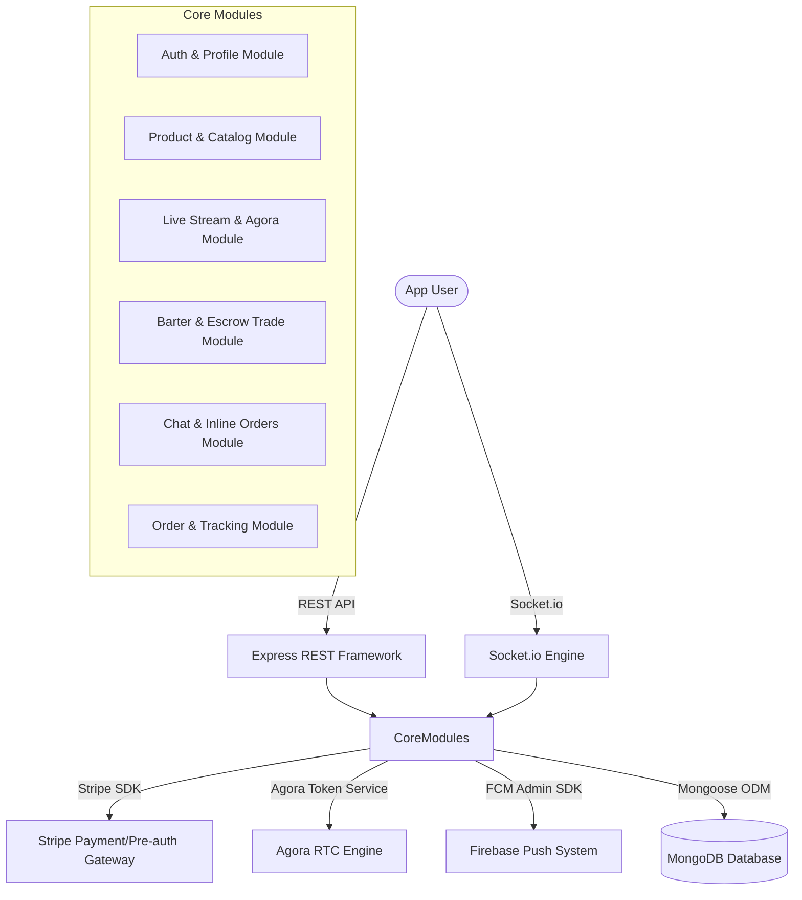

# Revised Implementation Plan - Senior Backend Architecture (Culture Cards LLC)

We have successfully analyzed the UI screens under [Culturecardsllc-UI](file:///d:/Mohosin/Mohosin/projects/culturecardsllc-server/Culturecardsllc-UI). Your design is extremely premium and polished, showcasing:
1. **Home / Discover Feed**: Live streams, trending tags, featured trade/bidding cards, and categorizations.
2. **Interactive Live Bidding**: Overlaid live chat, hearts/reactions count, pinned product card with live price, and direct "BID" or "Custom" action triggers.
3. **Trade/Barter Swap Engine**: A sophisticated escrow barter system where users can propose trade deals (Item A for Item B + cash supplement) with value delta alerts.
4. **Rich Inline Chat Integration**: Messages module featuring inline-embedded order tracking blocks ("ORDER SHIPPED 🚚" with map progress, carrier info, and confirm delivery triggers).
5. **Detailed Order Journey Tracking**: Clear status flows (Shipped -> Arriving Soon -> Delivered) with a granular cost breakdown (item, shipping, taxes, processing fee, foundation contributions).

Here is the robust, high-performance, senior-developer level backend architecture mapping all UI screens to production-grade engineering logic.

---

## Technical Architecture Overview



---

## 1. Database Schema Specifications

We will introduce highly optimized schemas with indexes for rapid search and high-concurrency bidding.

### A. Product & Catalog Module
Supports categorizations shown in the onboarding ("TCG", "Sports Cards", "Fine Art", "Streetwear") and "Available for Trade" listings.

```typescript
import { Schema, model, Document } from 'mongoose';

export interface IProduct extends Document {
  sellerId: Schema.Types.ObjectId;
  title: string;
  description?: string;
  images: string[];
  video?: string;
  category: 'Fine Art' | 'Sports Cards' | 'Rare Spirits' | 'Luxury Cars' | 'Electronics' | 'Streetwear' | 'TCG' | 'Digital Assets';
  condition: 'Mint' | 'Near Mint' | 'Excellent' | 'Good' | 'Fair';
  estValue: number;
  startingBid?: number;
  reservePrice?: number;
  buyNowPrice?: number;
  status: 'active' | 'sold' | 'unsold' | 'pending';
  stock: number;
  isFeatured: boolean;
  allowTrade: boolean;
}

const ProductSchema = new Schema<IProduct>({
  sellerId: { type: Schema.Types.ObjectId, ref: 'User', required: true, index: true },
  title: { type: String, required: true, trim: true },
  description: { type: String },
  images: [{ type: String }],
  video: { type: String },
  category: { 
    type: String, 
    enum: ['Fine Art', 'Sports Cards', 'Rare Spirits', 'Luxury Cars', 'Electronics', 'Streetwear', 'TCG', 'Digital Assets'], 
    required: true,
    index: true
  },
  condition: { type: String, enum: ['Mint', 'Near Mint', 'Excellent', 'Good', 'Fair'], required: true },
  estValue: { type: Number, required: true },
  startingBid: { type: Number },
  reservePrice: { type: Number },
  buyNowPrice: { type: Number },
  status: { type: String, enum: ['active', 'sold', 'unsold', 'pending'], default: 'active', index: true },
  stock: { type: Number, default: 1 },
  isFeatured: { type: Boolean, default: false },
  allowTrade: { type: Boolean, default: true }
}, { timestamps: true });

export const Product = model<IProduct>('Product', ProductSchema);
```

### B. Live Stream & High-Concurrency Bidding Module
Handles Agora session states, live viewer counting, pinned products, and real-time bid validation.

```typescript
export interface ILiveStream extends Document {
  sellerId: Schema.Types.ObjectId;
  title: string;
  description?: string;
  scheduledAt?: Date;
  status: 'scheduled' | 'live' | 'ended';
  agoraChannelName: string;
  pinnedProductId?: Schema.Types.ObjectId;
  viewersCount: number;
  likesCount: number;
}

const LiveStreamSchema = new Schema<ILiveStream>({
  sellerId: { type: Schema.Types.ObjectId, ref: 'User', required: true, index: true },
  title: { type: String, required: true },
  description: { type: String },
  scheduledAt: { type: Date },
  status: { type: String, enum: ['scheduled', 'live', 'ended'], default: 'scheduled', index: true },
  agoraChannelName: { type: String, required: true, unique: true },
  pinnedProductId: { type: Schema.Types.ObjectId, ref: 'Product' },
  viewersCount: { type: Number, default: 0 },
  likesCount: { type: Number, default: 0 }
}, { timestamps: true });

export interface IAuctionItem extends Document {
  streamId: Schema.Types.ObjectId;
  productId: Schema.Types.ObjectId;
  status: 'pending' | 'active' | 'completed' | 'failed';
  currentBid: number;
  highestBidderId?: Schema.Types.ObjectId;
  bidIncrement: number;
  timerDuration: number;
  endsAt?: Date;
}

const AuctionItemSchema = new Schema<IAuctionItem>({
  streamId: { type: Schema.Types.ObjectId, ref: 'LiveStream', required: true, index: true },
  productId: { type: Schema.Types.ObjectId, ref: 'Product', required: true, index: true },
  status: { type: String, enum: ['pending', 'active', 'completed', 'failed'], default: 'pending', index: true },
  currentBid: { type: Number, default: 0 },
  highestBidderId: { type: Schema.Types.ObjectId, ref: 'User', default: null },
  bidIncrement: { type: Number, default: 5 },
  timerDuration: { type: Number, default: 60 },
  endsAt: { type: Date }
}, { timestamps: true });
```

### C. Barter & Escrow Trade Module
Directly maps to the "Make Offer" (Rolex vs Off-White Tee + Cash) UI, tracking swap negotiations, escrow statuses, and validation of deltas.

```typescript
export interface ITradeOffer extends Document {
  senderId: Schema.Types.ObjectId;
  receiverId: Schema.Types.ObjectId;
  senderProductId: Schema.Types.ObjectId;
  receiverProductId: Schema.Types.ObjectId;
  cashSupplement: number; // Positive if sender pays extra, Negative if receiver pays
  escrowStatus: 'pending' | 'held' | 'released' | 'refunded';
  status: 'pending' | 'accepted' | 'declined' | 'completed' | 'expired';
  expiresAt: Date;
}

const TradeOfferSchema = new Schema<ITradeOffer>({
  senderId: { type: Schema.Types.ObjectId, ref: 'User', required: true, index: true },
  receiverId: { type: Schema.Types.ObjectId, ref: 'User', required: true, index: true },
  senderProductId: { type: Schema.Types.ObjectId, ref: 'Product', required: true },
  receiverProductId: { type: Schema.Types.ObjectId, ref: 'Product', required: true },
  cashSupplement: { type: Number, default: 0 },
  escrowStatus: { 
    type: String, 
    enum: ['pending', 'held', 'released', 'refunded'], 
    default: 'pending' 
  },
  status: { 
    type: String, 
    enum: ['pending', 'accepted', 'declined', 'completed', 'expired'], 
    default: 'pending', 
    index: true 
  },
  expiresAt: { type: Date, required: true }
}, { timestamps: true });

export const TradeOffer = model<ITradeOffer>('TradeOffer', TradeOfferSchema);
```

### D. Order & Tracking Module
Supports the detailed delivery page (Jersey City Distribution center, progress bar, fee structures).

```typescript
export interface IOrder extends Document {
  buyerId: Schema.Types.ObjectId;
  sellerId: Schema.Types.ObjectId;
  productId: Schema.Types.ObjectId;
  tradeOfferId?: Schema.Types.ObjectId;
  purchaseType: 'auction_win' | 'buy_now' | 'trade_swap';
  amountDetails: {
    itemSubtotal: number;
    shipping: number;
    taxes: number;
    processingFee: number;
    charityContribution: number;
    totalPaid: number;
  };
  paymentStatus: 'pending' | 'paid' | 'failed' | 'refunded';
  paymentIntentId?: string;
  shippingAddress: {
    street: string;
    city: string;
    state: string;
    postalCode: string;
    country: string;
  };
  deliveryStatus: 'pending' | 'shipped' | 'delivered' | 'cancelled';
  trackingDetails: {
    carrier: string;
    trackingNumber: string;
    estimatedDelivery?: Date;
    journeyUpdates: {
      status: string;
      description: string;
      location?: string;
      timestamp: Date;
    }[];
  };
}

const OrderSchema = new Schema<IOrder>({
  buyerId: { type: Schema.Types.ObjectId, ref: 'User', required: true, index: true },
  sellerId: { type: Schema.Types.ObjectId, ref: 'User', required: true, index: true },
  productId: { type: Schema.Types.ObjectId, ref: 'Product', required: true },
  tradeOfferId: { type: Schema.Types.ObjectId, ref: 'TradeOffer' },
  purchaseType: { type: String, enum: ['auction_win', 'buy_now', 'trade_swap'], required: true },
  amountDetails: {
    itemSubtotal: { type: Number, required: true },
    shipping: { type: Number, default: 0 },
    taxes: { type: Number, default: 0 },
    processingFee: { type: Number, default: 0 },
    charityContribution: { type: Number, default: 0 },
    totalPaid: { type: Number, required: true }
  },
  paymentStatus: { type: String, enum: ['pending', 'paid', 'failed', 'refunded'], default: 'pending', index: true },
  paymentIntentId: { type: String },
  shippingAddress: {
    street: { type: String, required: true },
    city: { type: String, required: true },
    state: { type: String, required: true },
    postalCode: { type: String, required: true },
    country: { type: String, required: true }
  },
  deliveryStatus: { type: String, enum: ['pending', 'shipped', 'delivered', 'cancelled'], default: 'pending', index: true },
  trackingDetails: {
    carrier: { type: String },
    trackingNumber: { type: String },
    estimatedDelivery: { type: Date },
    journeyUpdates: [{
      status: { type: String, required: true },
      description: { type: String, required: true },
      location: { type: String },
      timestamp: { type: Date, default: Date.now }
    }]
  }
}, { timestamps: true });

export const Order = model<IOrder>('Order', OrderSchema);
```

---

## 2. Senior Developer Logic & Optimization Patterns

### A. High-Concurrency Bidding Logic (No Over-Bidding Race Conditions)
To handle millions of users bidding on the same item, standard updates will fail. We will implement atomic DB updates matching against the `currentBid` or use a transaction locking structure.

```typescript
// Example service method preventing race conditions
export async function placeBidSecure(
  auctionItemId: string, 
  bidderId: string, 
  bidAmount: number
) {
  // 1. Atomically find and update ONLY if the new bid is higher than the current bid
  const updatedAuction = await AuctionItem.findOneAndUpdate(
    {
      _id: auctionItemId,
      status: 'active',
      $or: [
        { currentBid: { $lt: bidAmount } },
        { currentBid: 0 } // base case
      ]
    },
    {
      $set: {
        currentBid: bidAmount,
        highestBidderId: bidderId,
      }
    },
    { new: true }
  );

  if (!updatedAuction) {
    throw new Error('Bid rejected: Someone placed a higher or equal bid first.');
  }

  // 2. Anti-Sniping Check: If bid placed within last 10 seconds, extend endsAt by 15 seconds
  const tenSecondsFromNow = new Date(Date.now() + 10000);
  if (updatedAuction.endsAt && updatedAuction.endsAt < tenSecondsFromNow) {
    const extendedTime = new Date(updatedAuction.endsAt.getTime() + 15000);
    await AuctionItem.findByIdAndUpdate(auctionItemId, { $set: { endsAt: extendedTime } });
    updatedAuction.endsAt = extendedTime;
  }

  return updatedAuction;
}
```

### B. Dynamic Inline Chat Tracking Integration
The messaging controller will support injecting dynamic updates. If `deliveryStatus` shifts to `shipped` or a new `TradeOffer` is proposed, the system automatically appends a rich message record into the database containing the payload structure. The Flutter application can then seamlessly display this block in the chat stream.

```typescript
// Chat System Message structure
export interface ISystemMessage {
  chatId: Schema.Types.ObjectId;
  senderId: Schema.Types.ObjectId; // System or User ID
  messageType: 'text' | 'order_update' | 'trade_proposal';
  content: string;
  metadata?: {
    orderId?: string;
    tradeOfferId?: string;
    statusLabel?: string; // "ORDER SHIPPED", "PENDING REVIEW"
    trackingNumber?: string;
    eta?: string;
  };
}
```

---

## 3. Real-Time Socket Events Flow Matrix

We will structure the Socket server to handle highly dynamic streaming interactions:

| Event Name | Role | Payload | Description |
| :--- | :--- | :--- | :--- |
| `join-stream` | Client -> Server | `{ streamId, userId }` | Registers user to Socket room, increases stream viewer count, emits count updates. |
| `leave-stream`| Client -> Server | `{ streamId, userId }` | Unsubscribes from room, reduces viewer count. |
| `place-bid` | Client -> Server | `{ auctionItemId, bidAmount }` | Processes highly-secure bid, checks race conditions, extends timer if necessary, emits `new-bid`. |
| `new-bid` | Server -> Room | `{ currentBid, highestBidderId, endsAt }` | Broadcasts the updated auction details to all stream viewers instantly. |
| `stream-chat` | Client -> Server | `{ streamId, message }` | Validates content, broadcasts message to everyone in the room. |
| `stream-reaction`| Client -> Server| `{ streamId, type: 'heart'/'like' }` | Broadcasts live floats and increments total stream likes counter. |
| `trigger-spin`| Seller -> Server | `{ streamId, highestBidderId }` | Validates authorization, calculates randomized drop weights on backend, broadcasts `spin-result`. |
| `spin-result` | Server -> Room | `{ prizeName, rarity, degreeIndex }` | Sends outcome to all clients to animate the local spin-wheel. |

---

## 4. Workflows & Verification Steps

### Step 1: Core Schemas and Database Seeders
We will deploy the structural models for `Product`, `LiveStream`, `AuctionItem`, `TradeOffer`, and `Order`, and prepare clean seed data representing collectors' items (watches, cards, sneakers).

### Step 2: Advanced Socket Bidder & Timer Service
Implement the secure race-condition protected `placeBidSecure` engine inside `socketHelper.ts`. Validate with high concurrency simulated scripts.

### Step 3: Escrow Barter Swap APIs
Build endpoints under `/api/trades` to handle making, declining, accepting, and calculating delta balances on cross-item trades.

### Step 4: Inline Order Tracking System in Messages
Introduce systemic system messages and REST webhooks for updating shipping statuses and mapping locations.

---

### Verification
* **Concurrency stress scripts**: Simulate 100 simultaneous socket connections placing random bids to prove atomic data lock consistency.
* **Agora Token Debugging**: End-to-end token validation with simulated Agora RTC clients.
* **Stripe Hook Mocking**: Using test suite payments validation.
