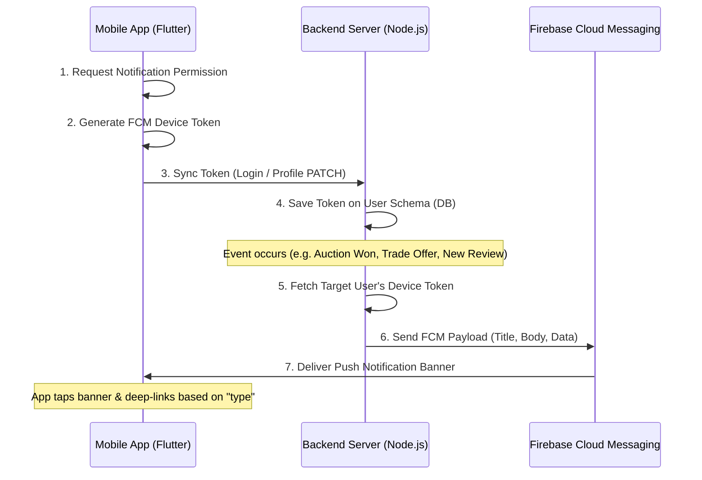

# Backend Push Notification Integration Guide (FCM API Specifications)

This document describes how the CultureCards backend server handles and sends push notifications via Firebase Cloud Messaging (FCM). It outlines the communication flow, the database storage of tokens, API specifications, and the payload format received by the mobile application.

---

## 🔄 How the Push Notification Flow Works

The backend follows a standard publisher-subscriber flow using the **Firebase Admin SDK** to communicate with Firebase Cloud Messaging (FCM):



---

## 1️⃣ Syncing the Device Token (API Endpoints)

For the backend to send a notification to a specific user, it must know their active **FCM Device Token**. The mobile app is responsible for updating this token on the server using either of the following endpoints:

### Option A: During Login / Social Login (Recommended)
* **Endpoints:** 
  * `POST /auth/login` (Password Login)
  * `POST /auth/social-login` (Google Login)
* **Request Body Parameters:**
  ```json
  {
    "email": "user@gmail.com",
    "password": "password123",
    "deviceToken": "FCM_DEVICE_TOKEN_STRING"
  }
  ```

### Option B: Profile Update Endpoint (Token rotation/refresh)
* **Endpoint:** `PATCH /users/profile`
* **Headers:** `Authorization: Bearer <JWT_ACCESS_TOKEN>`
* **Request Body Parameters:**
  ```json
  {
    "deviceToken": "FCM_DEVICE_TOKEN_STRING"
  }
  ```

---

## 2️⃣ Backend Database Schema Storage
The token is saved securely in the `users` collection in MongoDB:
```typescript
deviceToken: {
  type: String
}
```
*When a user logs out, the app should call the profile update endpoint to clear the token (`deviceToken: ""` or null) to prevent sending notifications to logged-out devices.*

---

## 3️⃣ FCM Message Payload Format (Server to Client)

The backend sends notifications containing a `notification` object (which triggers the OS banner automatically) and a `data` object (used for custom logic and deep-linking inside the app).

### Standard JSON Payload Structure:
```json
{
  "notification": {
    "title": "Notification Header",
    "body": "Notification body content/message."
  },
  "data": {
    "type": "NOTIFICATION_ACTION_TYPE",
    "actionUrl": "Optional deep-linking url",
    "actionText": "Optional action label",
    "customField1": "ID or metadata needed for redirection",
    "customField2": "..."
  }
}
```

---

## 4️⃣ Redirection Map (Deep-Linking Actions)

The app developer should read the `data.type` field from the push notification payload to determine which screen the user should be redirected to when they tap the notification banner:

| `data.type` Value | Payload Metadata Keys | Expected Action on Mobile App |
| :--- | :--- | :--- |
| **`NEW_MESSAGE`** | `senderId`, `messagePreview` | Open Chat room with `senderId` |
| **`TRADE_ACCEPTED`** | `tradeOfferId` | Open Trade/Escrow detail screen for `tradeOfferId` |
| **`TRADE_DECLINED`** | `tradeOfferId` | Open Trade details / Trade list |
| **`ORDER_UPDATE`** | `orderId` | Open Order Tracking/Shipment screen for `orderId` |
| **`AUCTION_WON`** | `auctionItemId`, `sellerId`, `bidAmount`, `actionUrl` | Open Checkout/Stripe WebView using `actionUrl` |
| **`STREAM_LIVE`** | `streamId`, `sellerId`, `actionUrl` | Join Agora live stream stream room for `streamId` |
| **`NEW_REVIEW`** | `reviewerId`, `rating`, `reviewId` | Open User Profile Reviews tab |
| **`NEW_REPORT`** | `reportId` | (Admin Only) Open admin reporting ticket details |
